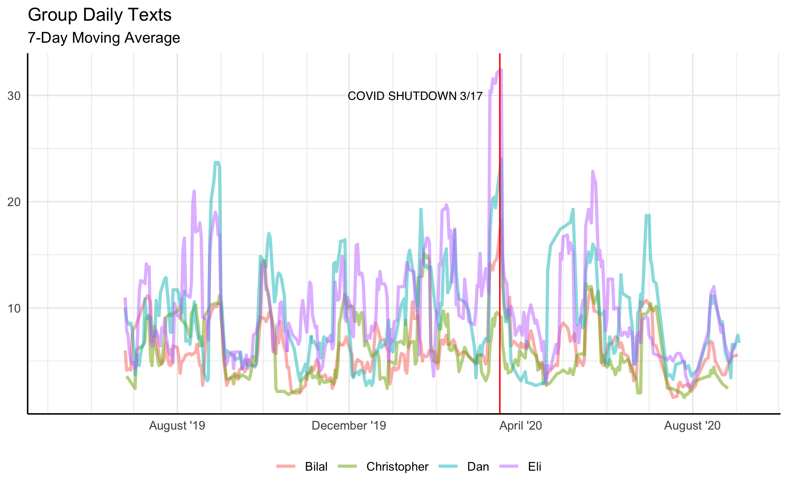
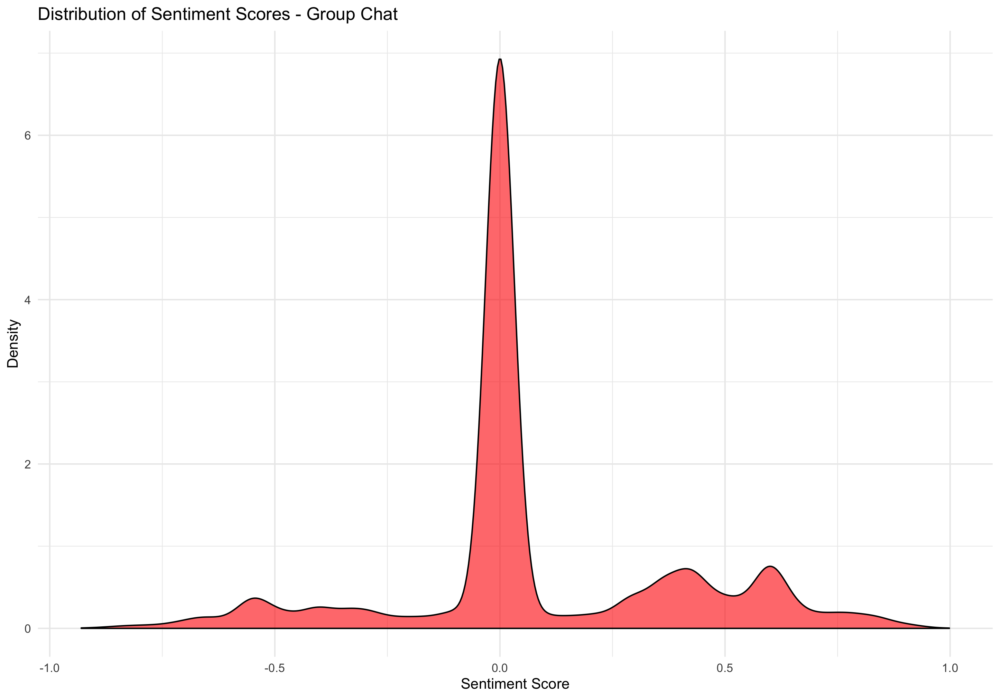

# Analyzing my iMessage Data

This project analyzes two years of my text message history and focuses on a specific group chat with me and several friends. Analysis includes simple exploration of trends, and assessment of average sentiments.

## Group Chat Analysis

